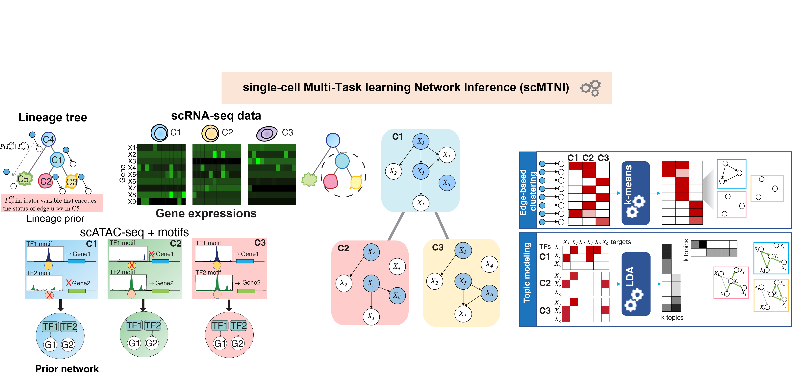

# single-cell Multi-Task learning Network Inference (scMTNI)


We have developed single-cell Multi-Task learning Network Inference (scMTNI), a multi-task learning framework for joint inference of cell type-specific gene regulatory networks that leverages the cell lineage structure and scRNA-seq and scATAC-seq mea- surements to enable robust inference of cell type-specific gene regulatory networks. scMTNI takes as input a cell lineage tree, cell type-specific scRNA-seq data and optional cell type-specific prior networks that can be derived from bulk or single-cell ATAC-seq datasets. 

The scMTNI model has the following benefits: 
- 1 uses multi-task learning allowing the learning procedure to be informed by the shared infor- mation across cell types, 
- 2 incorporates the lineage structure to influence the extent of sharing between the learned networks, 
- 3 incorporates prior information, such as motif-based prior network derived from scATAC-seq data, thereby integrating scRNA-seq and scATAC-seq data to infer gene regulatory network dynamics across cell lineages.

Zhang, S., Pyne, S., Pietrzak, S. et al. Inference of cell type-specific gene regulatory networks on cell lineages from single cell omic datasets. Nat Commun 14, 3064 (2023). https://doi.org/10.1038/s41467-023-38637-9

[](https://zenodo.org/badge/latestdoi/441968928)



## Step 1. Install
The code is compiled and tested for Linux environment. 
GSL (GNU Scientific Library) is used to handle matrix-related and vector-related operations.
It requires GCC version of gcc-6.3.1 and GNU extension with std=gnu++14 setting. The typical install time on a "normal" desktop computer is a few minutes.

1) git clone https://github.com/Roy-lab/scMTNI.git 
2) cd scMTNI/Code/ 
3) make


## Step 2. Prepare input files
The data for demo is in ExampleData/. The demo data contains 100 regulators and 300 genes.
All the files in ExampleData/ are subsamples of the original files, as a demo for the file format. The raw data is too large to upload.
The source data is available at https://zenodo.org/record/7879228. Please contact the Roy Lab for raw data if needed. 

## 2.1 integrating scRNA-seq and scATAC-seq using LIGER
Apply LIGER to integrate the scRNA-seq and scATAC-seq datasets, check LIGER (https://github.com/welch-lab/liger) for details. 
Input example files for scATAC-seq and scRNA-seq: ExampleData/LIGER/scATACseq.txt, ExampleData/LIGER/scRNAseq.txt

```
Rscript --vanilla Scripts/Integration/LIGER_scRNAseq_scATAC.R
```
The output files are in ExampleData/LIGER/. The liger cluster assginment is in ExampleData/LIGER/ligerclusters.txt

## 2.2 generating the prior network using scATAC-seq data and motifs
Check https://github.com/Roy-lab/scMTNI/blob/master/Scripts/genPriorNetwork/readme.md for details. 
Due to limitation of file size in Github, bam files are currently not provided in ExampleData/. For demo, please directly use the output prior networks ExampleData/cluster*_network.txt 
```
bash Scripts/genPriorNetwork/genPriorNetwork_scMTNI.sh
```
The example output files are ExampleData/cluster*_network.txt 

## 2.3 Prepare all input files and config file for scMTNI
### First prepare filelist.txt
The first column is the cell name, the second column is the location and filename of the expression data for each cell type. The example file ExampleData/filelist.txt:
```cluster8	ExampleData/cluster8.table
cluster3	ExampleData/cluster3.table
cluster2	ExampleData/cluster2.table
cluster1	ExampleData/cluster1.table
cluster6	ExampleData/cluster6.table
cluster9	ExampleData/cluster9.table
cluster10	ExampleData/cluster10.table
cluster7	ExampleData/cluster7.table
```

### Then prepare all the other input files based on ExampleData/filelist.txt and regulators list ExampleData/regulators.txt
Prepare input files with prior network:
```
indir=ExampleData/
filelist=${indir}/filelist.txt
regfile=${indir}/regulators.txt
python Scripts/PreparescMTNIinputfiles.py --filelist $filelist --regfile $regfile --indir $indir --outdir Results --splitgene 50 --motifs 1
```

Prepare input files without prior network:
```
python Scripts/PreparescMTNIinputfiles.py --filelist $filelist --regfile $regfile --indir $indir --outdir Results --splitgene 50 --motifs 0
```

### Prepare cell lineage tree:
The cell lineage tree file should have 5 columns describing the tree:
- 1. Child cell
- 2. Parent cell
- 3. Branch-specific gain rate (The probability that an edge is gained in a child given that the edge is absent in the predecessor cell)
- 4. Branch-specific loss rate (The probability that an edge is lost in a child given that the edge is present in the predecessor cell)

The example file for cell lineage tree ExampleData/celltype_tree_ancestor.txt

```cluster3	cluster8	0.2	0.2
cluster2	cluster3	0.2	0.2
cluster1	cluster2	0.2	0.2
cluster6	cluster2	0.2	0.2
cluster9	cluster6	0.2	0.2
cluster10	cluster6	0.2	0.2
cluster7	cluster10	0.2	0.2
```

## Step 3. Run
The input data for demo is in ExampleData/. The expected output is in Results/. The estimuated run time for the demo is around 7 minute.
The output network for each cell type is Results/cluster*/fold0/var_mb_pw_k50.txt

### Example usage of scMTNI with prior network
```
Code/scMTNI -f ExampleData/testdata_config.txt -x50 -l ExampleData/TFs_OGs.txt -n ExampleData/AllGenes.txt -d ExampleData/celltype_tree_ancestor.txt -m ExampleData/testdata_ogids.txt -s ExampleData/celltype_order.txt -p 0.2 -c yes -b -0.9 -q 2 
```
The above example will run scMTNI using all regulators and targets. 


Since scMTNI learns regulators on a per-target basis, the algorithm can easily be parallelized by running the algorithm for each target gene (or sets of genes) separately. For example, to run scMTNI using 10 genes, we can replace the -n parameter with a file that contains only 10 genes as in ExampleData/AllGenes0.txt:

```
Code/scMTNI -f ExampleData/testdata_config.txt -x50 -l ExampleData/TFs_OGs.txt -n ExampleData/AllGenes0.txt -d ExampleData/celltype_tree_ancestor.txt -m ExampleData/testdata_ogids.txt -s ExampleData/celltype_order.txt -p 0.2 -c yes -b -0.9 -q 2 
```

### Example usage of scMTNI without prior network
```
Code/scMTNI -f ExampleData/testdata_config_noprior.txt -x50 -v1 -l ExampleData/TFs_OGs.txt -n ExampleData/AllGenes.txt -d ExampleData/celltype_tree_ancestor.txt -m ExampleData/testdata_ogids.txt -s ExampleData/celltype_order.txt -p 0.2 -c yes -b -0.9 -q 0
```

### Example usage of INDEP with prior network (INDEP: single cell cluster version of scMTNI)
Add parameter i and set it to yes for running INDEP. celltype_tree_ancestor.txt (parameter -d) file is not needed for INDEP

```
Code/scMTNI -f ExampleData/cluster1_config.txt -x50 -l ExampleData/cluster1_TFs_OGs.txt -n ExampleData/cluster1_AllGenes.txt -m ExampleData/cluster1_ogids.txt -s ExampleData/cluster1.txt  -i yes -c yes -b -0.9 -q 2
```

### Example usage of INDEP without prior network (INDEP: single cell cluster version of scMTNI)
Add parameter i and set it to yes for running INDEP. celltype_tree_ancestor.txt (parameter -d) file is not needed for INDEP

```
Code/scMTNI -f ExampleData/cluster1_config_noprior.txt -x50 -l ExampleData/cluster1_TFs_OGs.txt -n ExampleData/cluster1_AllGenes.txt -m ExampleData/cluster1_ogids.txt -s ExampleData/cluster1.txt  -i yes -c yes -b -0.9 -q 0
```

### Parameter Explanations
f : config file with six columns, rows for each cell. Each cell's row should have the following species-specific entries:
- 1. Cell Name
- 2. Location of expression data with file name (cell.table)
- 3. Location to place outputs
- 4. List of regulators to be used
- 5. List of target genes to be used
- 6. List of motifs to be used. This file should have three tab-separated columns, listing the regulator, target, and motif score

x : Maximum # of regulators to be used for a given target.

p : default 0.5. The probability that an edge is present in the root cell.

l : List of the orthogroups (id #s) to be considered as regulators. Note: a regulator must also be present in the species-specific list of regulators given in the species-specific config file (parameter f).
The list should only have the orthogroup IDs, not the names of the genes belonging to the orthogroup. The gene names are specified through parameter `m` which maps the orthogroup IDs to the gene names. 

n : List of the orthogroups (id #s) to be considered as targets. Note: a target must also be present in the species-specific list of targets given in the species-specific config file (parameter f).
The list should only have the orthogroup IDs, not the names of the genes belonging to the orthogroup. The gene names are specified through parameter `m` which maps the orthogroup IDs to the gene names.

d : The cell lineage tree to be used. This file should have 5 columns describing the tree:
- 1. Child cell
- 2. Parent cell
- 3. Branch-specific gain rate (The probability that an edge is gained in a child given that the edge is absent in the predecessor cell)
- 4. Branch-specific loss rate (The probability that an edge is lost in a child given that the edge is present in the predecessor cell)

m : A file describing the gene relationships. The first column of this file is of the format OGID{NUMBER}_{DUP}. Each NUMBER represents an orthogroup. For orthogroups with duplications, DUP is the duplication count/id. If there are no duplications in the dataset being used, DUP will always be 1. If we are working with only a single species, then the gene names in a orthogroup are the same gene name followed by the cell cluster ID, e.g., {GeneX_cluster1, GeneX_cluster2, GeneX_cluster3}. Since scMTNI allows different gene sets in different cell clusters, we can set that gene to "None" for the cell clusters where it is absent. For example, if `GeneX` is absent in cluster 2, the aforementioned orthogroup will contain {GeneX_cluster1, None, GeneX_cluster3}. 

s : A list of the cells present in the gene file (parameter m), in the order they exist in the gene file

b : specifies the β0 parameter which controls the sparsity of the network, a penalty for adding new edges. The β0 parameter is a sparsity prior that controls the penalty of adding of a new edge to the network, which takes a negative value (β0 < 0). We suggest trying β0 for values between −5 and −0.1. A smaller (more negative) value will add a greater cost to edge addition and end up with a sparser network. 

q : specifies the β1 parameter which controls how strongly motif instances are incorporated as prior (β1 ≥ 0). We suggest setting β1 to a value between 0 and 5.  A higher value will result in motif prior network being valued more strongly.  β1 is set to 0 when there is no cell type-specific motif information available.

i: yes -> run INDEP, no -> run scMTNI. By default, it will set i to no and run scMTNI.


### Additional note 1 (how to generate subsamples of a given expression dataset)
In the manuscript, we applied scMTNI on multiple subsamples of a given gene expression dataset.
It was done to improve the stability or robustness of the results.
To generate subsamples of a given dataset, please use the following script.

```
# Input:
# --indir [the location of the filelist file; please see Step 2.3]
# --filelist [the name of the filelist file]
# --nseed [number of desired subsamples]
# --fraction (optional) [fraction of cells each subsample should have compared to the number of cells in the original dataset; default = 0.5]

## Generate 100 subsamples of a given dataset.
## Each subsample should have half the number of cells in the original dataset (by default).
## For each subsample, the cells will be selected without replacement.
python Scripts/Datasubsample_sc_merged.py --filelist $filelist --indir $indir --nseed 100

```

### Additional note 2 (how to create the orthogroup related input files for scMTNI)
`Scripts/PreparescMTNIinputfiles.py` is the script to generate `testdata_ogids.txt` and `TFs_OGs.txt`.
OGIDs needs to have the `OG[serial_number]_1` format.
If you prepare the `filelist.txt` and `regulators.txt` as shown below, you can directly use the script `Scripts/PreparescMTNIinputfiles.py`.

First prepare `filelist.txt`.  
The first column is the cell name, the second column is the file path to the expression data for each cell type. 
The example file `ExampleData/filelist.txt`:
```
cluster3   ExampleData/cluster3.table
cluster2   ExampleData/cluster2.table
cluster1   ExampleData/cluster1.table
cluster6   ExampleData/cluster6.table
cluster9   ExampleData/cluster9.table
cluster10   ExampleData/cluster10.table
cluster7   ExampleData/cluster7.table
```
Then prepare all the other input files based on `ExampleData/filelist.txt` and regulators list `ExampleData/regulators.txt`.
Finally, run the script `Scripts/PreparescMTNIinputfiles.py` as follows to generate the orthogroup related files:
```
indir=ExampleData/
filelist=${indir}/filelist.txt
regfile=${indir}/regulators.txt
python Scripts/PreparescMTNIinputfiles.py --filelist $filelist --regfile $regfile --indir $indir --outdir Results --splitgene 50 --motifs 1
```
A detailed description of how to create the other input files is provided in Step [2.3](https://github.com/Roy-lab/scMTNI#23-prepare-all-input-files-and-config-file-for-scmtni).

### Additional note 3 (Interpretation of the output file of scMTNI)

Inferred network (Example: Results/cluster1/fold0/var_mb_pw_k50.txt)
The first column is the regulator, and the second column is the target gene. The value on the 3rd column is the regression coefficient. The absolute value of the coefficient is the edge weight, larger value corresponds to a higher ranking of the edge.
```
KHSRP_cluster1	MECR_cluster1	0.464787
ILF2_cluster1	MECR_cluster1	-0.340458
CHP1_cluster1	MECR_cluster1	0.263274
POLR2F_cluster1	SFPQ_cluster1	-0.228401
POLR2L_cluster1	EBNA1BP2_cluster1	0.504227
```

Model parameters (Example: Results/cluster1/fold0/modelparams.txt)
"Var=" is the target gene, "CondVar=" is the conditional variance of the target gene given regulators, "CondBias=" is the conditional bias, and "CondWt=" corresponds to the regression coefficient for each regulator.
```
Var=MECR_cluster1	Wt=-1	CondVar=0.266455	CondBias=0.217826	CondWt=KHSRP_cluster1=0.464787,ILF2_cluster1=-0.340458,ZNF580_cluster1=0.220504,CHP1_cluster1=0.263274,EIF5B_cluster1=-0.142582
Var=SFPQ_cluster1	Wt=-1	CondVar=0.355977	CondBias=0.527808	CondWt=POLR2F_cluster1=-0.228401
```

However, we suggest running scMTNI using the stability selection framework:
# 1) generate 50 (or more) subsamples of the dataset (See https://github.com/Roy-lab/scMTNI#additional-note-1-how-to-generate-subsamples-of-a-given-expression-dataset)
# 2) run scMTNI on each of the subsamples
# 3) create a consensus network across the inferred networks of all subsamples (See https://github.com/Roy-lab/scMTNI#40-generate-consensus-network-for-subsample-results) 
In the consensus network, the 3rd column is the confidence score ranging from 0 to 1 for each inferred edge. We suggest to keep edges with at least 80% confidence. Example: https://github.com/Roy-lab/scMTNI/blob/master/Results_subsample/analysis/cluster1/consensus_edges.txt
https://github.com/Roy-lab/scMTNI/blob/master/Results_subsample/analysis/cluster1/consensus_edges.txt

```
AAK1	FAM49A	0.1
AAK1	GLTPD1	0.1
AAK1	GSTM1	0.2
ARID3A	VAMP8	0.6
ARNTL	ANAPC1	0.8
```

## Step 4. Evaluation
### 4.0 Generate consensus network for subsample results

```
# Input:
# 1 [number of subsamples]
# 2 [number of regulators]
# 3 [cell file order file path]
# 4 [scMTNI results directory path]
# 5 [number of ogids]

nseed=10
maxReg=50
cellfile=ExampleData/celltype_order.txt
indir=Results_subsample/
nogid=50

bash Scripts/Postprocessing/Makeconsensusnetwork.sh $nseed $maxReg $cellfile $indir $nogid 

```

Apply 80% edge confidence limit to consensus edges
```
bash Scripts/Postprocessing/genConsensus_cf0.8.sh
```

### 4.1 Compute AUPR:
```
bash Scripts/Evaluation/aupr_wrapper_list_intersection.sh
```
 
### 4.2 Compute F-score for top k edges compared to gold standard datasets

```
cellfile=ExampleData/celltype_order.txt
python Scripts/Evaluation/fscore_filterPred.py  --inferred $predicted_net --gold ${GSfile} --regulators $regulators --targets $targets --outdir $outpath
```

## Step 5. Network dynamics analysis
### 5.1 edge-based k-means clustering analysis:
Apply k-means clustering on edge\*cell confidence matrix to find subnetworks with different patterns of conservation.

```
cd Scripts/Network_Analysis/
matlab -nodisplay -nosplash -nodesktop -r "StablityKmeansClustering; quit()"
```

Apply k-means for k=1-30 to the subsample results with a 0.8 confidence limit:
```
matlab -nodisplay -nosplash -nodesktop -r "addpath('Scripts/Network_Analysis'); StablityKmeansClustering_cf08; quit()"
```
Output directory:
Results_subsample/analysis/kmeansclustering_cf0.8


Generate a bubbleplot and kmeans heatmap per cluster
```
# Command line arguments
# 1 [start of kmeans range i.e. 15]
# 2 [end of kmeans range i.e. 30]
# 3 [path to cluster dir]
# 4 [path to output dir]
# 5 [edge threshold i.e. cf0.8]
# 6 [prefix i.e. testdata]

bash Scripts/Network_Analysis/kmeans_bubbleplot_wrapper.sh 15 30 Results_subsample/analysis/kmeansclustering_cf0.8/ Results_subsample/analysis/kmeansclustering_cf0.8/ cf0.8 testdata
```
Output directory:
Results_subsample/analysis/kmeansclustering_cf0.8/kmeans_k\*


### 5.2 topic model-based dynamic network analysis:
Apply LDA topic models to examine subnetwork level rewiring 

Prepare input matrix for subsample results
```
# Input:
# 1 [cell file order file path]
# 2 [scMTNI results directory path]
# 3 [edge filter threshold; i.e. 'full', '\_cf0.8'] 
Rscript Scripts/Network_Analysis/prepareNetmatrix.R ExampleData/celltype_order.txt Results_subsample/analysis/cluster1 \_cf0.8
```

Apply LDA to subsample results
```
matlab -nodisplay -nosplash -nodesktop -r "addpath('Scripts/Network_Analysis'); LDA_analysis('Results_subsample/analysis/lda_TFcellbygene/','ExampleData/celltype_order.txt',10,'_filteredlowexpression','_cf0.8','testdata',0); quit()"
```

Obtain giant component of inferred networks
```
Rscript --vanilla Scripts/Network_Analysis/plotNetworks_LDA_cf0.8.R 10

bash Scripts/Network_Analysis/getGiantComponents.sh
```

Obtain top regulators per component
```
bash Scripts/Network_Analysis/getTopRegPerComponent.sh
```

Make network figures per topic: 
```
Rscript Scripts/Network_Analysis/makeAllGraphs.R
```

Make regulators bubble plot per topic:
```
Rscript Scripts/Network_Analysis/makeTopicRegBubble_ggplot.R
```


