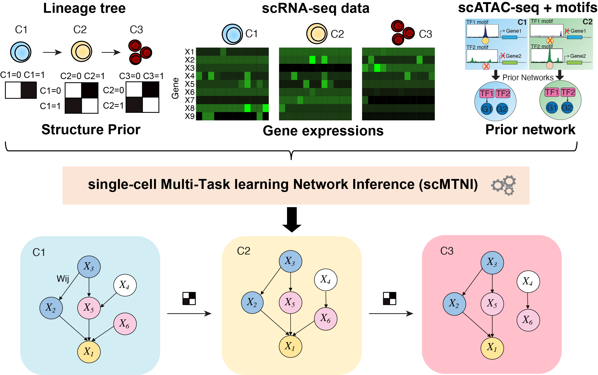

# single-cell Multi-Task learning Network Inference (scMTNI)


We have developed single-cell Multi-Task learning Network Inference (scMTNI), a multi-task learning framework for joint inference of cell type-specific gene regulatory networks that leverages the cell lineage structure and scRNA-seq and scATAC-seq mea- surements to enable robust inference of cell type-specific gene regulatory networks. scMTNI takes as input a cell lineage tree, cell type-specific scRNA-seq data and optional cell type-specific prior networks that can be derived from bulk or single-cell ATAC-seq datasets. 

The scMTNI model has the following benefits: 
- 1) uses multi-task learning allowing the learning procedure to be informed by the shared infor- mation across cell types, 
- 2) incorporates the lineage structure to influence the extent of sharing between the learned networks, 
- 3) incorporates prior information, such as motif-based prior network derived from scATAC-seq data, thereby integrating scRNA-seq and scATAC-seq data to infer gene regulatory network dynamics across cell lineages.



## INSTALLATION
1) git clone https://github.com/Roy-lab/mrtle.git 
2) cd mrtle/code 
3) make


## EXAMPLE USAGE OF scMTNI with motif prior
```./scMTNI -f testdata/testdata_config.txt -x5 -v1 -l testdata/TFs_OGs.txt -n testdata/AllGenes.txt -d testdata/celltype_tree_ancestor.txt -m testdata/testdata_ogids.txt -s testdata/celltype_order.txt -p 0.2 -c yes -b -0.9 -q 2```

The above example will run scMTNI using all regulators and targets. 

Since scMTNI learns regulators on a per-target basis, the algorithm can easily be parallelized by running the algorithm for each target gene (or sets of genes) separately. For example, to run scMTNI using only OG59 (includes HOG1), we can replace the -n parameter with a file that contains only OG59 as such:

```./scMTNI -f testdata/testdata_config.txt -x5 -v1 -l testdata/TFs_OGs.txt -n testdata/AllGenes0.txt -d testdata/celltype_tree_ancestor.txt -m testdata/testdata_ogids.txt -s testdata/celltype_order.txt -p 0.2 -c yes -b -0.9 -q 2```


## PARAMETER EXPLANATIONS
Parameter Explanations
f : config file with six columns, rows for each cell. Each cell's row should have the following species-specific entries:
1. Cell Name
2. Prefix of .table files (cell.table)
3. Location to place outputs
4. List of regulators to be used
5. List of target genes to be used
6. List of motifs to be used. This file should have three tab-separated columns, listing the regulator, target, and motif score

x : Maximum # of regulators to be used for a given target.
v : Used for cross-validation. Can be left at 1.
p : default 0.5. The probability that an edge is present in the root cell.
l : List of the orthogroups (id #s) to be considered as regulators. Note: a regulator must also be present in the species-specific list of regulators given in the species-specific config file (parameter f)
n : List of the orthogroups (id #s) to be considered as targets. Note: a target must also be present in the species-specific list of targets given in the species-specific config file (parameter f)
d : The cell lineage tree to be used. This file should have 5 columns describing the tree:
1. Child cell
2. Parent cell
3. Branch-specific gain rate (The probability that an edge is gained in a child given that the edge is absent in the predecessor cell)
4. Branch-specific loss rate (The probability that an edge is lost in a child given that the edge is present in the predecessor cell)
m : A file describing the orthology relationships. The first column of this file is of the format OGID{NUMBER}_{DUP}. Each NUMBER represents an orthogroup. For orthogroups with duplications, DUP is the duplication count/id. If there are no duplications in the dataset being used, DUP will always be 1.
s : A list of the cells present in the OGIDS file (parameter m), in the order they exist in the OGIDS file
